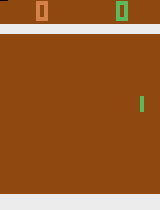
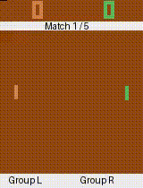
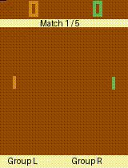
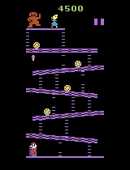
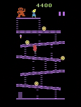

# Reinforcement Learning Project

## Part 1: Pong
### Run the code
Install the dependencies:
```
cd Part1
pip install -r requirements.txt
```

**To be done. Explain how to train the agent**


### Videos

- The video shows our **best agent** (right), trained with DQN, playing against the default opponent.


## Part 2: Pong Tournament
### Run the code
Install the dependencies:
```
cd PONG-TOURNAMENT
pip install -r requirements.txt
```

**To be done. Explain how to train the agents, flip the weights, evaluate...**


### Videos



- First video shows the agents competing after being trained with Adversarial Training.
- Second video shows the agents competing after being trained with Self-Play.
- Third video shows the agents competing after being trained with Weight Flipping. This is our **best agent**.

### Use our best left & right agents
The checkpoints are located in `PONG-TOURNAMENT/left_model.zip` and `PONG-TOURNAMENT/right_model.zip`.
Download them and load them as simple PPO models for the tournament.


## Part 3: Donkey Kong
### Run the code
**Install the dependencies:**
```
cd DKONG
pip install -r requirements.txt
```
Edit the `config.yml` file to your liking, setting the `wandb` and paths.

**Start the training (optional):**
```
python main.py
```
This will train and evaluate the agent over time, creating video files that are saved on the `videos` folder.

**Render a video with the best model:**
```
python render_checkpoint_video.py
```
This will save a .mp4 video in `videos/best_model_video_eval/` with our best agent playing and hopefully completing the screen.


### Videos



- First video shows how the agent initially got stuck jumping barrels in the floor level. This was when default barrel reward was used.
- Second video shows how the agent learned to use the hammer, but then ignored the last ladder to climb.
- Third video shows the **final agent** that was able to climb to the top and complete the first screen.
